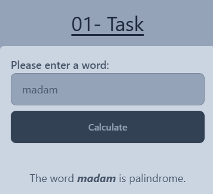
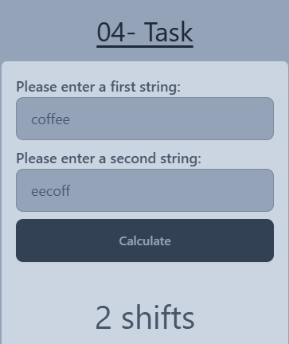
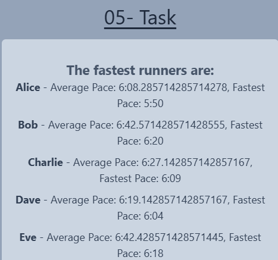

# Module A Tasks

This repository contains solutions for Module A tasks. Each task is implemented in its respective folder, structured as follows:

## Task List

### Task 1: JS Palindromes
**Description:**  
A JavaScript function to determine whether a given word is a palindrome (reads the same forward and backward).  
Examples of palindromes: `radar`, `level`, `civic`, `rotator`, `madam`.

**Screenshot:**  

---

### Task 2: JS Longest Word
**Description:**  
A JavaScript function to find the longest word in a given text. The function returns a message containing the longest word.

**Screenshot:**  

---

### Task 3: HTML/CSS Grid Layout
**Description:**  
An adaptive design created using HTML and CSS Grid. It works on both large screens and mobile devices. The breakpoint is set at `768px`.

**Screenshot:**  

---

### Task 4: JS Rotate Strings
**Description:**  
A JavaScript function that determines how many characters are needed to shift one string forward to match another. If the strings do not match after any valid shift, the function returns `-1`.

**Screenshot:**  

---

### Task 5: JS Fastest Runners
**Description:**  
A JavaScript function that filters runners who completed a 7-kilometer run faster than the average time of all runners. The result is sorted by finish time and contains the name, average pace, and fastest pace of each runner.

**Screenshot:**  

---

### Task 6: CSS Counter
**Description:**  
An interactive application created with HTML and CSS, consisting of four boxes. Clicking a box toggles its selection (highlighted in gold), and the sum of the selected box values is displayed below.

**Screenshot:**  

---

### Task 7: JS Digital Clock
**Description:**  
A digital clock built using HTML and JavaScript. The clock displays the current time (hours:minutes:seconds) and updates every second.

**Screenshot:**  

---

### Task 8: CSS Grid Areas
**Description:**  
A CSS layout created using grid areas. The final design accurately matches the provided sample image.

**Screenshot:**  

---

### Task 9: JS Sum Two Largest Integers
**Description:**  
A JavaScript function that calculates the sum of the two largest integers in an array. If the array contains fewer than two elements, the function returns `0`.

**Screenshot:**  

---

### Task 10: CSS Steps
**Description:**  
A CSS animation created using the `steps()` function. The animation uses a sprite image to display the correct sequence of frames.

**Screenshot:**  

---

## Instructions
1. Each task is located in its respective folder (`Task-01` to `Task-10`).
2. The folder structure follows this pattern:
