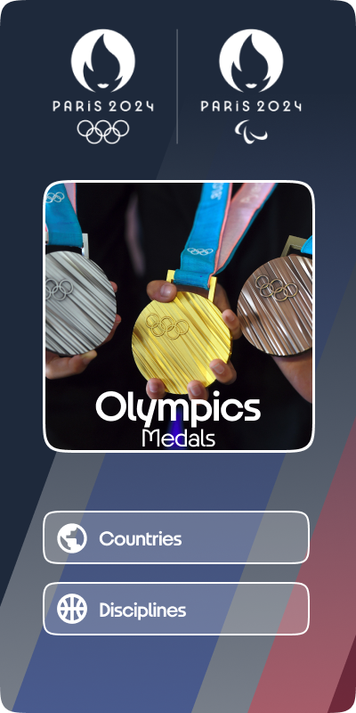
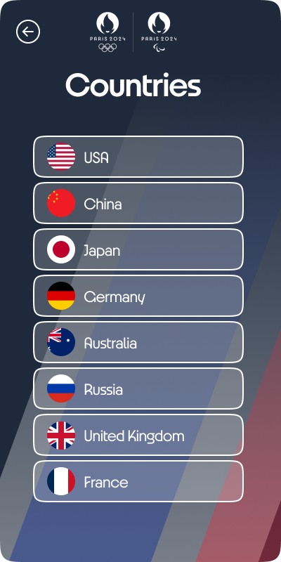
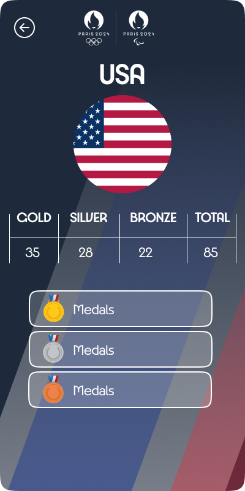
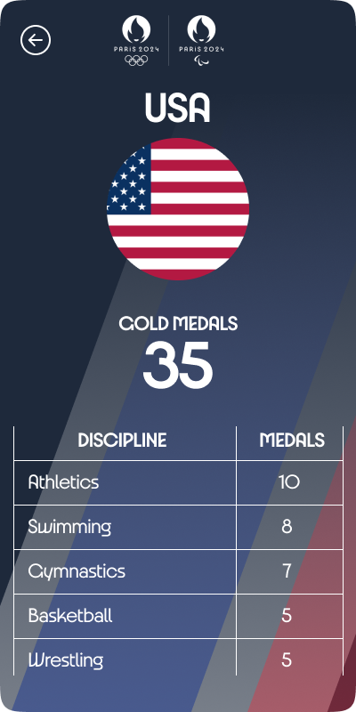
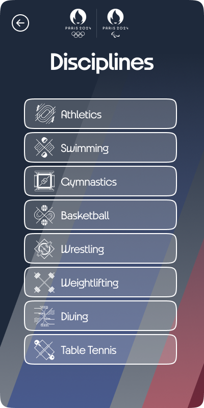
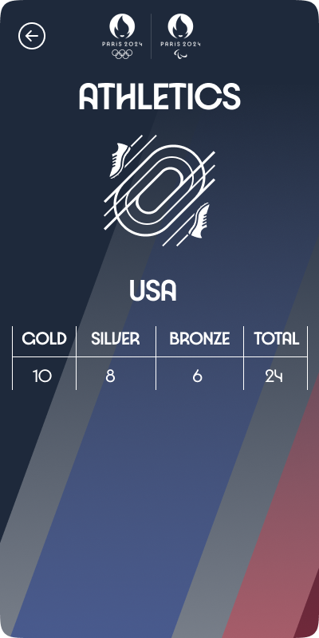

# Front-end Olympics Medals - WorldSkills Kazakhstan 2024

## Table of Contents

- [Introduction](#introduction)
- [Project Description and Requirements](#project-description-and-requirements)
- [Pages Overview](#pages-overview)
  - [Welcome Page](#welcome-page)
  - [Countries Page](#countries-page)
  - [Country Page](#country-page)
  - [Medals by Discipline Page](#medals-by-discipline-page)
  - [Disciplines Page](#disciplines-page)
  - [Discipline by Countries Page](#discipline-by-countries-page)
  - [Discipline by Country Page](#discipline-by-country-page)
- [Screenshots](#screenshots)

## Introduction

**Task Duration**: 2 hours

Develop a mobile-optimized web application that allows users to view the Olympic medal standings for the 2024 Paris Olympics. The app should utilize a REST API to retrieve and sort data by medal type, discipline, and country.

**Endpoint**:  
`http://localhost:3000/countries`

To run the server, use the following command in the console:  
`json-server --watch json/db.json`

### Design Expectations
- The app should be mobile-optimized, with the primary test environment being the iPhone 14 Pro screen size.
- The design must follow the provided mockups, with content displayed in fullscreen mode and vertical scrolling when necessary.
- Layouts and images are located in the `media/layouts` and `media/images/` directories, respectively.

## Project Description and Requirements

The application consists of seven pages:

1. Welcome Page
2. Countries Page
3. Country-specific Page (displays the medal count for a selected country)
4. Medals by Discipline Page (displays medal counts by discipline type)
5. Disciplines Page
6. Discipline by Countries Page (displays medal counts by country in a discipline)
7. Discipline by Country Page (displays medal counts for a country in a specific discipline)

## Pages Overview

### Welcome Page
- Displays buttons to navigate to the Countries Page and the Disciplines Page.
- On clicking "Countries," the user is directed to the Countries Page.
- On clicking "Disciplines," the user is directed to the Disciplines Page.

### Countries Page
- Displays a list of countries with flags and names retrieved from the API.
- On clicking a country, the user is directed to the Country-specific Page.
- The back button returns to the Welcome Page.

### Country Page
- Displays the medal counts (gold, silver, bronze) and the total medal count for the selected country.
- On clicking a medal type (gold, silver, bronze), the user is directed to the Medals by Discipline Page.
- The back button returns to the Countries Page.

### Medals by Discipline Page
- Displays a list of disciplines with the corresponding medal counts of the selected type and the total count.
- The back button returns to the Country Page.

### Disciplines Page
- Displays a list of disciplines with icons and names.
- On clicking a discipline, the user is directed to the Discipline by Countries Page.
- The back button returns to the Welcome Page.

### Discipline by Countries Page
- Displays a list of countries that participated in the selected discipline, along with their total medal count in that discipline.
- The back button returns to the Disciplines Page.
- On clicking a country, the user is directed to the Discipline by Country Page.

### Discipline by Country Page
- Displays the gold, silver, and bronze medal counts for the selected country in the chosen discipline, along with the total medal count.
- The back button returns to the Discipline by Countries Page.

## Screenshots

Below are the screenshots for each page.

### Welcome Page

### Countries Page

### Country-specific Page

### Medals by Discipline Page

### Disciplines Page

### Discipline by Countries Page

### Discipline by Country Page

